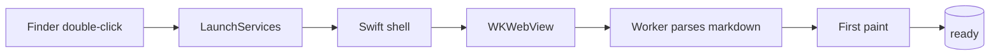

# Markview

A fast, native-feeling markdown viewer for macOS 26.

## Why

Designed to render a document **beautifully** in under a quarter of a second, then
get out of your way. The shell is native SwiftUI; the body is a `WKWebView` running
a tiny rendering pipeline.

> [!NOTE]
> This sample exercises every feature the renderer supports.

> [!TIP]
> Use `⌘+` / `⌘-` / `⌘0` to zoom. Use the sidebar (`⌘\``) to jump by heading.

> [!WARNING]
> Remote images are blocked by default.

## Typography

The prose layer is **Tailwind Typography**, so headings, lists, tables, blockquotes,
code, and `<kbd>` chrome follow a real hierarchy — not flat styles.

Ligatures and kerning are on. Inline code like `Array.prototype.flatMap` reads as text.

## Lists

- Bullet one
- Bullet two with a [link](https://example.com)
  - Nested
  - Deeply nested
- Bullet three

1. First
2. Second
3. Third

### Task list

- [x] Ship the proposal
- [x] Scaffold the web pipeline
- [ ] Prototype SwiftUI shell
- [ ] Notarise the `.dmg`

## Tables

| Feature | Status | Notes |
|---|---:|---|
| GFM tables | ✅ | `markdown-it` built-in |
| Task lists | ✅ | via plugin |
| Footnotes[^1] | ✅ | via plugin |
| Math | ✅ | KaTeX |
| Diagrams | ✅ | lazy Mermaid |

[^1]: Footnotes render at the bottom of the document, linked both ways.

## Math

Inline: the identity $e^{i\pi} + 1 = 0$ is famous.

Block:

$$
\int_{-\infty}^{\infty} e^{-x^2}\,dx = \sqrt{\pi}
$$

And a matrix:

$$
A = \begin{pmatrix} a & b \\ c & d \end{pmatrix}
$$

## Code

TypeScript:

```ts
export function greet(name: string): string {
  return `Hello, ${name}!`;
}

const users = ['Ada', 'Linus', 'Grace'];
users.map(greet).forEach(line => console.log(line));
```

Rust:

```rust
fn main() {
    let v: Vec<i32> = (1..=5).collect();
    let sum: i32 = v.iter().sum();
    println!("sum = {sum}");
}
```

Swift:

```swift
import SwiftUI

struct ContentView: View {
    var body: some View {
        Text("Hello, Liquid Glass")
            .font(.title)
            .glassEffect()
    }
}
```

## Diagram



## Images

Images scale to the content width. Local and `data:` images are permitted; remote
hosts are blocked by CSP unless explicitly allowed.

## Closing

Scroll. Select. Print. `⌘F`. Everything should feel like a document viewer,
not a web app pretending to be one.